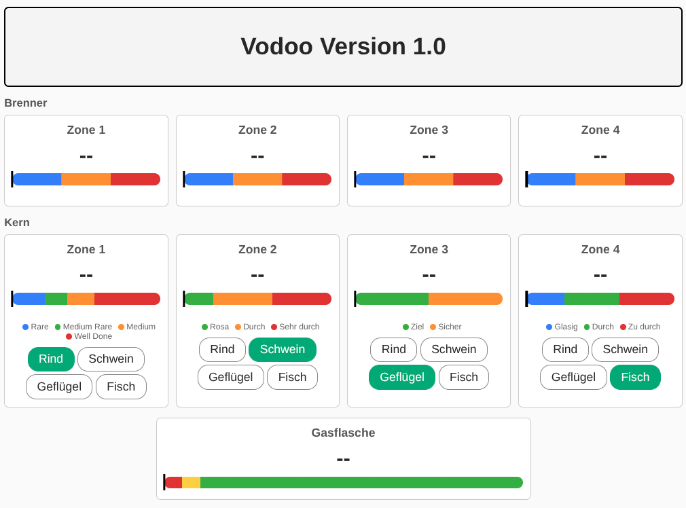

# ESP32 Grillthermo

Firmware für die Anzeige der Temperaturen eines Otto Wilde Grills G32. Das Projekt ersetzt funktional das nicht mehr erhältliche Original-Anzeigegerät von Otto Wilde.

## Hardware

- **Board:** ESP32-S3 DevKitC
- **Grill:** Otto Wilde G32

## Funktionen

- Bluetooth-Kommunikation mit dem Grill
- Anzeige von 4 Brennerbereichen und 4 Thermometern
- Bereitstellung der Daten über einen Webserver
- Konfigurationsshell über USB (CDC-ACM)

### Beispiel der Webanzeige



## Entwicklungsumgebung

- **RTOS:** Zephyr OS 4.4
- **Buildsystem:** west

## Dateistruktur

```
ESP32_Grillthermo/
├── west.yml                          # West-Manifest, pinnt Zephyr auf festen Commit
├── .gitignore
├── README.md
├── scripts/
│   └── west-init.sh                  # Bootstrap des west-Workspace nach dem Klonen
└── app/                              # Firmware-Quellcode
    ├── CMakeLists.txt                # CMake Build-Definition
    ├── prj.conf                      # Kconfig-Projektkonfiguration
    ├── boards/
    │   ├── esp32s3_devkitc_procpu.conf     # Board-spezifische Kconfig-Optionen
    │   └── esp32s3_devkitc_procpu.overlay  # DTS-Overlay (USB CDC-ACM)
    └── src/
        ├── main.c                          # Einstiegspunkt der Firmware
        └── shell.c                         # USB-Shell-Kommandos
```

### Beschreibung der Dateien

| Datei | Beschreibung |
|---|---|
| `west.yml` | West-Workspace-Manifest. Pinnt Zephyr auf einen festen Commit (reproduzierbarer Build auf allen Rechnern). |
| `scripts/west-init.sh` | Bootstrap-Script: richtet nach dem Klonen den west-Workspace ein (`west init -l`, `west update`, Blobs). |
| `app/CMakeLists.txt` | CMake-Konfiguration für das Zephyr-Build-System. Listet alle zu kompilierenden Quelldateien. |
| `app/prj.conf` | Kconfig-Konfiguration. Aktiviert Zephyr-Module wie Bluetooth, WiFi und HTTP-Server. |
| `app/boards/esp32s3_devkitc_procpu.conf` | Board-spezifische Kconfig-Optionen für das ESP32-S3 DevKitC. |
| `app/boards/esp32s3_devkitc_procpu.overlay` | DTS-Overlay: leitet Shell und Console auf USB CDC-ACM um. |
| `app/src/main.c` | Einstiegspunkt der Firmware, initialisiert den USB-Stack. |
| `app/src/shell.c` | Shell-Kommandos zur Konfiguration von WiFi und System. |

## Erste Schritte

### Voraussetzungen

West und das Zephyr SDK müssen installiert sein. Siehe [Zephyr Getting Started Guide](https://docs.zephyrproject.org/latest/develop/getting_started/index.html).

**Wichtig:** `ZEPHYR_BASE` darf **nicht** gesetzt sein. Dieses Projekt bringt über `west.yml` sein eigenes, auf einen festen Commit gepinntes Zephyr mit (eigener west-Workspace). Ein global gesetztes `ZEPHYR_BASE` (z. B. aus `~/.bashrc`) würde den Build auf ein anderes Zephyr umlenken — in dem Fall den Export entfernen.

### Python-Umgebung einrichten

Zephyr und west benötigen eine Python-Virtual-Environment im Workspace-Topdir:

```bash
cd esp32-grillthermo-ws
python3 -m venv .venv
source .venv/bin/activate
pip install west
```

Nach dem ersten `west update` (siehe unten) die Zephyr-Abhängigkeiten nachinstallieren:

```bash
pip install -r zephyr/scripts/requirements.txt
```

**Hinweis:** Die Aktivierung (`source .venv/bin/activate`) muss in jeder neuen Shell-Session wiederholt werden, bevor `west` verwendet wird.

### Workspace einrichten

Das Repo ist das Manifest-Repo eines eigenen west-Workspace. Zephyr und die Module liegen **neben** dem Repo im Workspace-Topdir (deshalb in `.gitignore`, nicht im Repo selbst):

```
esp32-grillthermo-ws/      <- Workspace (Topdir, kein git-Repo)
├── ESP32_Grillthermo/     <- dieses Repo (west-Manifest, self.path)
├── zephyr/                <- in west.yml gepinnte Zephyr-Version
└── modules/ bootloader/ tools/
```

Einrichtung per Bootstrap-Script:

```bash
mkdir esp32-grillthermo-ws && cd esp32-grillthermo-ws
git clone <repo-url> ESP32_Grillthermo
ESP32_Grillthermo/scripts/west-init.sh
```

Das Script führt `west init -l`, `west update` und `west blobs fetch hal_espressif` aus. Alternativ manuell:

```bash
mkdir esp32-grillthermo-ws && cd esp32-grillthermo-ws
git clone <repo-url> ESP32_Grillthermo
west init -l ESP32_Grillthermo   # Topdir = esp32-grillthermo-ws
west update                      # gepinntes Zephyr + Module holen
west blobs fetch hal_espressif   # ESP32-WiFi/BT-Blobs (nicht in west update enthalten)
```

> In ein Verzeichnis namens `ESP32_Grillthermo` klonen — der Name muss zu `self.path` in `west.yml` passen.

### Firmware bauen

```bash
cd ESP32_Grillthermo
west build -b esp32s3_devkitc/esp32s3/procpu -d build app
```

### Firmware komplett neu bauen

```bash
west build -p always -b esp32s3_devkitc/esp32s3/procpu -d build app
```

### Firmware flashen

```bash
west flash
```

Falls esptool das Gerät nicht findet (Meldung „Could not connect to an Espressif device …") oder versehentlich `/dev/ttyS0` statt `/dev/ttyACM0` probiert, läuft auf dem ESP wahrscheinlich noch die alte Firmware und der ROM-Bootloader ist nicht aktiv. In den Download-Modus kommt man so:

- **Per Shell** (wenn die alte Firmware noch reagiert): in der Shell `bootloader` eingeben und mit der konfigurierten PIN bestätigen — der ESP startet direkt im Download-Modus neu.
- **Per Hardware**: am DevKitC `BOOT` gedrückt halten, kurz `RESET` drücken, `BOOT` loslassen.
- **Port explizit angeben**, falls esptool den falschen Port wählt:
  ```bash
  west flash --esp-device /dev/ttyACM0
  ```

Nach erfolgreichem Flash startet der ESP per Hard-Reset automatisch wieder in der normalen Firmware.

### Shell-Zugriff via USB

Nach dem Flashen erscheint das Gerät als virtueller serieller Port (USB CDC-ACM). Verbindung herstellen mit:

```bash
screen /dev/ttyACM0 115200
# oder
minicom -D /dev/ttyACM0 -b 115200
```

Verfügbare Kommandos:

| Kommando | Beschreibung |
|---|---|
| `wifi set <ssid> <password>` | WiFi-Zugangsdaten konfigurieren |
| `config show` | Aktuelle Konfiguration anzeigen |
| `help` | Alle verfügbaren Kommandos anzeigen |

## Coding Guidelines

Der Code folgt dem MISRA-C-Standard.
